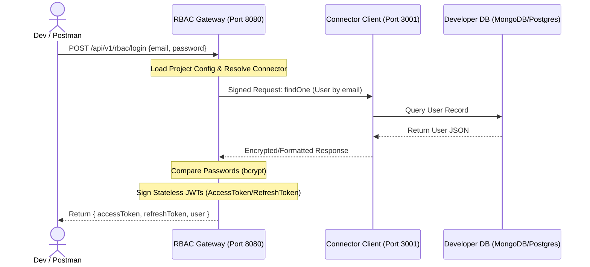

# PostPipe Stateless RBAC Testing Guide

This guide describes how to run and test the Stateless Role-Based Access Control (RBAC) system in the **PostPipe** environment.

The PostPipe RBAC system works on a **Bouncer & Router (Stateless Gateway)** model:
* **Stateless Gateway (`rbac-backend`)**: Acts as the gatekeeper. It holds **no end-user data**, passwords, roles, or permission states. Instead, it signs and translates requests, verifies JWTs, and delegates actual database queries to the Developer's Connector.
* **Developer's Connector (`static-system/my-connector`)**: Receives signed RBAC requests from the gateway, executes database operations against the developer's database (MongoDB/PostgreSQL), and returns raw results.
* **Next.js Frontend (PostPipe Web Dashboard)**: Provides UI interfaces to configure projects, inspect audit logs, and bootstrap or manage users/roles.

---

## 🛠️ System Architecture Diagram



---

## ⚙️ Prerequisites & Setup

### 1. Database & Connector
Ensure your Developer Connector and database are running. Typically, the connector runs on `http://localhost:3001`.
Make sure your MongoDB or Postgres instance is running and has the correct collections/tables matching the PostPipe RBAC schema fields (e.g. `users`, `roles`, `permissions`, `user_roles`, `role_permissions`).

### 2. Configure the RBAC Gateway (`rbac-backend`)
Create a `.env` file in the `rbac-backend/` root directory if it does not exist:

```env
PORT=8080
# Project Config DB details (if used by the gateway to resolve connector keys)
# DB_URI=mongodb://localhost:27017/postpipe-system
```

### 3. Start the RBAC Gateway
Run the gateway using `ts-node` or by compiling:

```bash
cd rbac-backend
# Install dependencies if not already done
npm install

# Run the dev server
npx ts-node src/index.ts
```

Gateway will be running at `http://localhost:8080`.

---

## 🧪 Testing the API Gateway (via Postman / curl)

All endpoints below reside under `http://localhost:8080/api/v1/rbac`.

### 1. Health Check
* **Endpoint**: `GET /health`
* **Purpose**: Verify the gateway is running.
* **Response**:
```json
{
  "status": "ok",
  "service": "PostPipe Stateless RBAC Gateway",
  "version": "2.0.0",
  "architecture": "stateless",
  "stores_user_data": false
}
```

---

### 2. Authentication Flow

#### A. User Login
* **Endpoint**: `POST /login`
* **Headers**: 
  * `x-project-id`: `<your-project-id>`
* **Request Body**:
```json
{
  "email": "admin@postpipe.io",
  "password": "securepassword"
}
```
* **Response**:
```json
{
  "success": true,
  "data": {
    "accessToken": "eyJhbGciOi...",
    "refreshToken": "eyJhbGciOi...",
    "user": {
      "id": "usr_9281a",
      "email": "admin@postpipe.io",
      "roles": ["Administrator"],
      "permissions": ["user.create", "user.delete", "role.assign"]
    }
  }
}
```

#### B. Get Current User Profiling (`/me`)
* **Endpoint**: `GET /me`
* **Headers**:
  * `Authorization`: `Bearer <accessToken>`
* **Response**:
```json
{
  "success": true,
  "data": {
    "id": "usr_9281a",
    "email": "admin@postpipe.io",
    "roles": ["Administrator"],
    "permissions": ["user.create", "user.delete"]
  }
}
```

#### C. Logout
* **Endpoint**: `POST /logout`
* **Headers**:
  * `Authorization`: `Bearer <accessToken>`
* **Purpose**: Invalidates existing tokens by incrementing the user's `token_version` in the connector database.
* **Response**:
```json
{
  "success": true,
  "data": {
    "message": "Logged out successfully"
  }
}
```

---

### 3. User & Role Management (Requires Permissions)

These routes require a valid `Authorization` header containing a token with the corresponding permission.

| Endpoint | Method | Required Permission | Description |
| :--- | :--- | :--- | :--- |
| `/users` | `GET` | `user.list` | List users (supports `?limit=50&offset=0`) |
| `/users` | `POST` | `user.create` | Create a new user with hashed password |
| `/users/:id` | `DELETE` | `user.delete` | Delete user |
| `/roles` | `GET` | `role.list` | List roles |
| `/roles` | `POST` | `role.create` | Create a new role |
| `/roles/:id` | `DELETE` | `role.delete` | Delete role |
| `/assign-role` | `POST` | `role.assign` | Assign role to user (`{ userId, roleId }`) |
| `/revoke-role` | `POST` | `role.revoke` | Revoke role from user (`{ userId, roleId }`) |
| `/permissions` | `GET` | `permission.list` | List available permissions |
| `/permissions` | `POST` | `permission.create`| Create permission |

#### Example: Assigning a Role to a User
* **Endpoint**: `POST /assign-role`
* **Headers**:
  * `Authorization`: `Bearer <accessToken>`
* **Body**:
```json
{
  "userId": "usr_12345",
  "roleId": "role_admin"
}
```

---

## 🖥️ Testing via the Frontend Dashboard

1. **Start the Frontend Next.js Dev Server**:
   ```bash
   npm run dev
   ```
2. **Access the RBAC View**:
   * Navigate to `http://localhost:3000/dashboard/rbac` (or `/dashboard/forms` which integrates RBAC controls).
3. **Bootstrap RBAC Setup**:
   * Use the **RBAC Setup Component** (`src/components/dashboard/rbac-setup.tsx`) to initialize base tables, seeding default roles (`Administrator`, `Editor`, `Viewer`) and permissions.
4. **Inspect Audit Logs**:
   * Any logins, logouts, role assignments, or user deletions generate audit logs in the gateway which are sent back to your workspace client. Verify that they are rendering in your admin panel.
