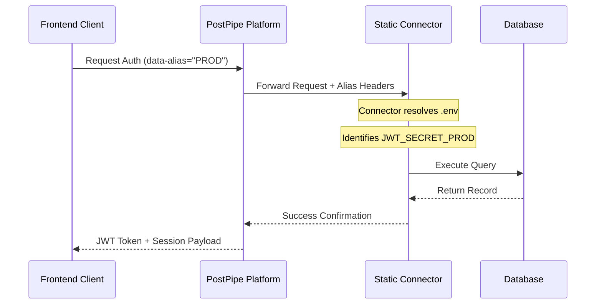

# Auth Presets & Aliases

The PostPipe authentication architecture is designed for multi-environment scalability. Using **Auth Presets** and **Aliases**, you can manage configuration securely across isolated deployments from a single codebase.

## What is an Auth Preset?

An **Auth Preset** is a centralized configuration schema for authentication rules and providers. Rather than hardcoding authentication parameters per project, you define a preset in the PostPipe Dashboard and reference it dynamically.

**A Preset configuration includes:**
- **Providers**: OAuth integrations (Google, GitHub, etc.) and email/password settings.
- **Redirection URIs**: Callback paths for successful authentication and session termination.
- **Security Policies**: JWT expiration limits, session duration, and password requirements.
- **Database Target**: The specific database instance handling user records.

## Architecture Flow: Alias Mapping



---

## The Alias System

The **Alias System** maps your PostPipe Dashboard configurations to the physical environment variables on your server infrastructure using deterministic suffixes.

### Problem Context
If an infrastructure hosts multiple distinct projects or environments (e.g., `Staging` and `Production`), they require distinct secret keys (e.g., `JWT_SECRET`). Hardcoding these globally creates collisions.

### Solution
By defining an alias (e.g., `STG` and `PROD`), PostPipe dynamically resolves variables based on the request origin:
- `JWT_SECRET_STG`
- `JWT_SECRET_PROD`

---

## Creating an Auth Preset

1. **Dashboard Access**: Navigate to the **Auth Preset Generator** in the PostPipe console.
2. **Configuration**: Define the preset parameters (e.g., "Production Environment").
3. **Alias Assignment**: Under Advanced Settings, assign an uppercase identifier (e.g., `PROD`).
4. **Generation**: Save the preset to receive the unique `projectId` and the list of required environment variables.

### Environment Variable Mapping

When a preset utilizes an alias like `PROD`, you must append this suffix to the respective variables within your infrastructure's `.env` file:

```env
# Global variable (no suffix)
DATABASE_URL=mongodb://...

# Aliased variables (with _PROD suffix)
FRONTEND_URL_PROD=https://production-app.com
JWT_SECRET_PROD=your_secure_random_string
SMTP_PASSWORD_PROD=your_smtp_credential
```

---

## Frontend Integration

Upon configuring the preset and alias, update the authentication script tag on your client application to include the `data-alias` attribute.

```html
<script 
  src="https://postpipe.in/api/public/cdn/auth.js" 
  data-project-id="your-unique-project-id"
  data-alias="PROD"
  data-project-alias="APPLICATION_NAME"
></script>
```

### Script Parameter Reference:
- **`data-project-id`**: The unique identifier of the Auth Preset.
- **`data-alias`**: Instructs the backend which `_SUFFIX` to apply during environment variable resolution.
- **`data-project-alias`**: A semantic identifier used for internal branding and logging.

---

## Operational Guidelines

> [!TIP]
> **Naming Conventions**: Maintain short, uppercase strings for aliases (3-5 characters) to ensure clarity across environments (e.g., `DEV`, `STG`, `PROD`).

> [!IMPORTANT]
> **Secret Management**: Never expose aliased secrets to the client. Environment variables must only reside on your secure server or connector instances.

> [!NOTE]
> **Brand Consistency**: The `projectAlias` value is embedded in automated communications (e.g., password reset emails). Ensure it accurately reflects the target application.
