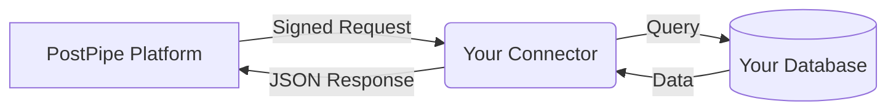

> [!NOTE]
> **Developer Reference**  
> This document explains the architecture behind PostPipe's Static and Dynamic integration paths.

## The Hybrid Model

PostPipe is a Hybrid Development Platform that connects:

1. **Static Data Sources**: Existing databases (MongoDB or PostgreSQL).
2. **Dynamic Applications**: Custom full-stack applications built from scratch.

---

## Part 1: Static Connector (Secure Proxy)

The Static Connector provides a secure bridge to your existing database, allowing interaction with modern frontends without custom API development.

### Request Flow



### Core Mechanisms

1. **Indirect Access**: PostPipe infrastructure never directly accesses your database, eliminating the need for IP whitelisting.
2. **Connector Deployment**: A lightweight Node.js service (the Connector) runs within your own infrastructure (e.g., Vercel, AWS, Railway).
3. **Secure Tunneling**: The Connector listens for cryptographically signed requests from PostPipe and executes queries locally within your VPC.
4. **Authentication**: All incoming requests are validated using SHA-256 HMAC signatures (`X-PostPipe-Signature`).
5. **Adapter Resolution**: The Connector automatically determines the database type (MongoDB or PostgreSQL) based on configuration parameters.
6. **Dynamic Routing**: Requests are routed to specific databases by mapping target IDs to corresponding environment variables (e.g., `MONGODB_URI_MARKETING`).

**Advantages**:
- Zero Vendor Lock-in.
- Strict data sovereignty.
- Immediate API access to legacy schemas.

---

## Part 2: Dynamic CLI (Scaffolding Engine)

The Dynamic Ecosystem accelerates the development of new applications by scaffolding complete, production-ready Next.js backends.

### Command Initialization

```bash
npx create-postpipe-app my-project
```

### Internal Process

1. **Scaffolding**: The CLI generates a repository based on selected parameters (Next.js, Tailwind, Database Engine).
2. **Pre-Configuration**: Authentication (Auth.js), database connections, and API routes are automatically configured.
3. **Component Injection**: Core Dynamic Components (e.g., authentication, forms) are installed and ready for integration.

**Advantages**:
- **Speed**: Reduces initial setup overhead.
- **Consistency**: Standardizes architecture across projects.
- **Ownership**: You retain full control of the generated source code.

---

## Summary Comparison

| Feature | Static Connector | Dynamic CLI |
| :--- | :--- | :--- |
| **Primary Use Case** | Existing Databases | New Projects |
| **Deployment Model** | Middleware Server | Full Application |
| **Data Flow** | Proxy Tunneling | Direct Application-to-Database |
| **Database Support** | MongoDB / PostgreSQL | Framework-dependent |
| **Design Philosophy** | Integration | Generation |
